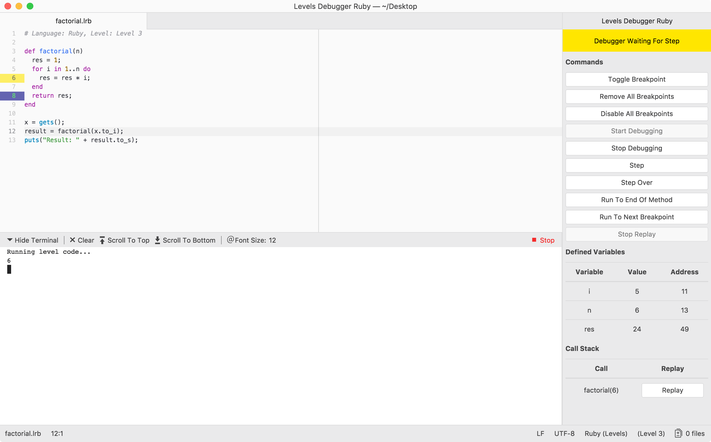

# Debugging package for `levels-language-ruby`

This package contains a debugger for use with the [levels-language-ruby](https://github.com/lakrme/atom-levels-language-ruby) package, which in turn uses the [levels](https://github.com/lakrme/atom-levels) package. Both packages are required dependencies and will be installed automatically if they are not installed already.

To get started, you may want to take a look at the [manual](./docs/manual.pdf), to get you up and running.

Using this debugger you will be able to step through your Ruby programs line by line, toggle breakpoints and inspect variables. You will be able to see the call stack and replay your program from a call on forward.

**Note:** This package is not meant as a general purpose Ruby debugger for Atom. It will only work with the `levels-language-ruby` dialect as it is meant to support the beginners computer science course taught at [Kiel University](https://www.uni-kiel.de), which uses the `levels-language-ruby` dialect.

## Requirements

To use the debugger you need at least a Java 8 runtime environment.